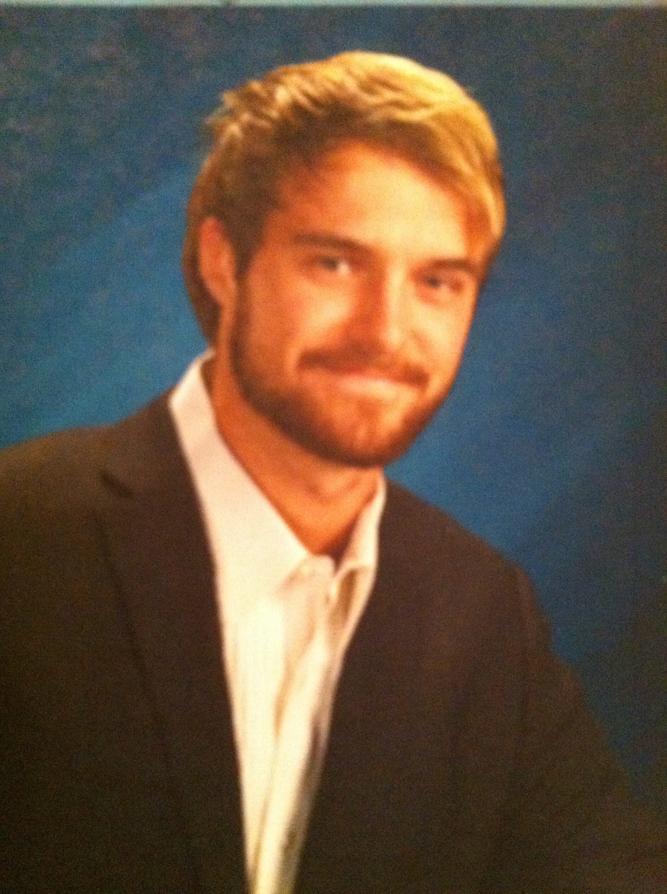

# My background and motivation.
In fall 20xx I entered my senior year of my bachelor’s in Philosophy at SUNY Binghamton, and for a brief period of time I worked under professor Nicole Hassoun, an assistant professor of Philosophy at Binghamton, and the founder of the website global-health-impact.org. The purpose of Dr. Hassoun’s website is to create a rating index for life-saving drugs that measures their impact on health in developing countries across the globe. Ultimately, her project aims to incentivize pharmaceutical companies to increase their humanitarian impact. Professor Hassoun’s project inspired me, however, it also made me realize just how crucial a good website is to nearly any project with an aim to impact the world, and how ignorant I was in regard to web development and the field of computer science at large. Several years and programming courses in Python and Java later and I was starting a masters in computer science. At present I have completed 9 credit hours of CS classes at New Paltz, covering topics in data structures, Java, assembly language, and databases, and an online course in HTML and CSS.
Due to my inquisitive nature, my true passion is philosophy and philosophy of religion, but this passion extends also to the most trivial of things, as I love to know how things work, whether it be my cars transmission or a door knob. My masters in computer science is for me another exciting endeavor in discovering how things work. What I hope to get out of this class is a working knowledge of web development in its present form and best practices. Ultimately, I want to take the skills I gain from this class and others, and use them to serve a company or institution which seeks to improve the lives and well being of others.

## Project Scope
The accompanying project will be a combination of my in-class work with added personal touches. Principally,it is to be learning experience in which I will gain skills and then put those skills to work in another project, to be found in the adjacent repository, titled "personal_project."

### Contact Information
If you have any questions, contact me at butironr1@hawkmail.newpaltz.edu 